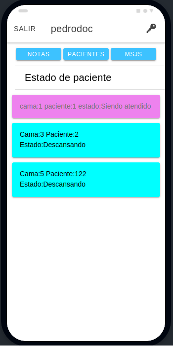
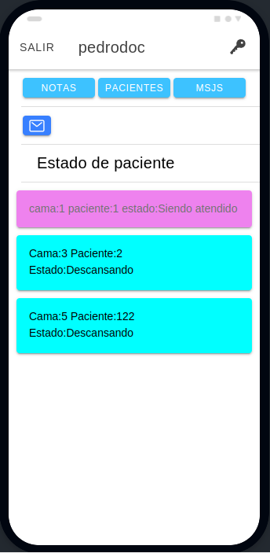

# ClientNurse
MobileApp for a Nurse Call System.\
This mobile application  is presented in partial fulfillment of the requirements
for the degree of IOT specialist of the UBA.

## First steps for running the app

Install Ionic:
```
$ npm install -g @ionic/cli
```

Download this repository. Navigate to the folder and run the app:
```
$ cd  ClientNurse
$ ionic serve
```
or: 
```
$ ionic lab
```

This will run the app on the browser.

## Application description:

This mobile application connects to a system/backend through mqtt topics. It has three different modes of use: as administrator, as a nurse and as a doctor.

### 1. Home page 

In this main page, the user can go to System config page or to the Login Page.


### 2. System Config page

In this system config page, you can set the ip and the port of the MQTT broker where the backend system is running. When you press save, it is saved to the local storage, when you press reset, the Mqtt client that is running the app is stopped, and then, in order to test it you need to press "test", if everything is working, below 'client' is shown the connection caracteristic.\

 

### 3. Login page
After successfully connect to the system, you can login to it using your user and password.


### 4. Entering administrator mode

In this mode you can monitor the status of the beds("occupied,calling nurse, in a programmed task, unoccupied") or the status of the users.

 

### 5. Entering Medical mode
In this mode the doctor can monitor the status of the patients(pressing the 'patients' button),  write/delete a note for one patient, or only listen for a nurse message.

  

#### 5.1 Editing a note
After selecting a patient, the user need to press the 'go' button.

  

Then, if the user press "ask" the system will retrieve the patients information('firstname','lastname' and numberId). If the user presses Notes, all the patient's notes will be retrieved from the system. If the user presses "add note", the edition page will appear.

   

Pressing send the note will be saved in the system's database.

#### 5.2 Monitoring a patient

If a patient calls a nurse the status will be updated accordingly. If a nurse ask something... a notification of a message in basket will appear.

  
 

#### 5.3 Response to messages

The messages could be of text type or audio type. In this version of the app, the audio messages are limited to less of 10 seconds.

